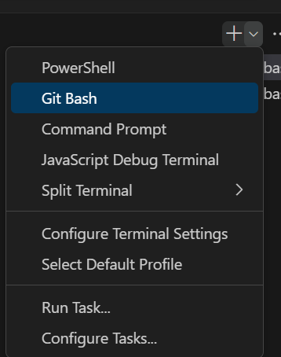
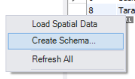
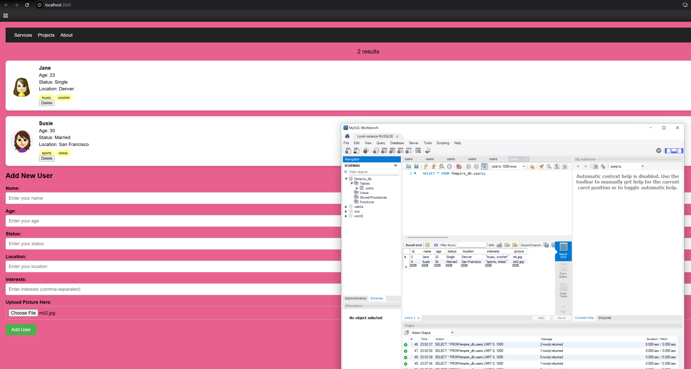
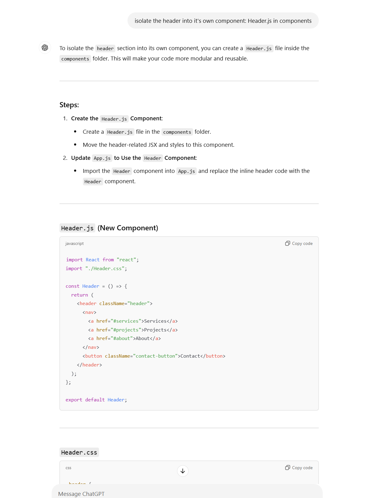
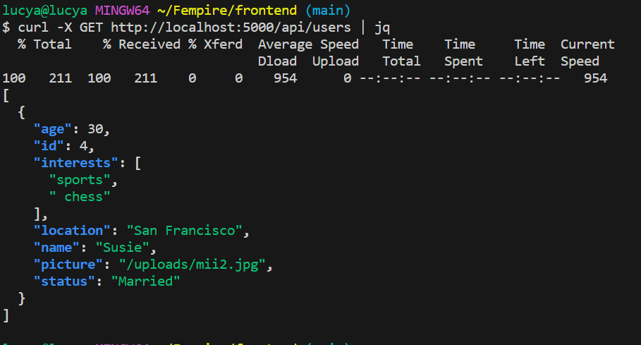

# Fempire

## Prerequisites

The following should be downloaded and installed before proceeding with setup:

MySQL Workbench: https://www.mysql.com/products/workbench/

node.js: https://nodejs.org/en/download/package-manager/

VSCode: https://code.visualstudio.com/

(Windows users only) Git bash: https://git-scm.com/downloads/win

(Windows users only): when opening VSCode terminal, navigate to the plus sign in the top right of the terminal window, select the dropdown next to it, and change to "Git Bash":



If you are a MacOS or Linux user, bash or zsh should work for your terminal and be compatible with the steps below already

## Setup

Run MySQL Workbench, create a password for your instance and keep it handy, as it will be used each time you connect to the db

Right click in the "Schemas" column to the left and select "Create Schema":



For the name, enter `fempire_db` and select Apply near the bottom. A new window will pop up confirming the creation, click Apply again

Clone the repo:

`git clone https://github.com/lagamaite/Fempire.git`

`cd Fempire`

Create a `.env` file with the following contents:

```
DB_USER=root
DB_PASSWORD=testpass # or your unique db password you set 
DB_HOST=localhost
DB_NAME=fempire_db
```

We create this local file because we do not want to hard-code any sensitive passwords

Next, open the backend directory:

`cd backend`

Install dependencies: `pip install -r requirements.txt`

Run flask server: `python3 server.py`

We will keep this terminal window running in the background as this is our backend server. Open a new terminal window (for Windows users, same steps as in the Prerequisites above)

Confirm that node.js was properly installed:

`node -v`

`npm -v`

Next, open frontend directory:

`cd frontend`

Install node_modules: `npm install`

Run the React app: `npm start`

Browser should automatically open to http://localhost:3000/ and display React app

Happy coding! 

Here is a working demo image of the current UI + running database:



## Tips while coding:

### ChatGPT is your bestie 

No really, look at all this sweet code I was able to get from it helping me debug. Being a good prompt engineer can go a long way with productivity. The future is now, utilize what is available:



### Testing backend

Postman is a great tool for individually testing API endpoints for backend and will return the proper status codes or errors as well as response objects. This is optional to have, but may be handy in the future:

https://www.postman.com/

You can also use curl commands to test endpoints. Example:

`curl -X GET http://localhost:5000/api/users | jq`


